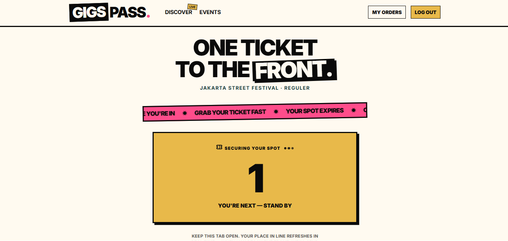
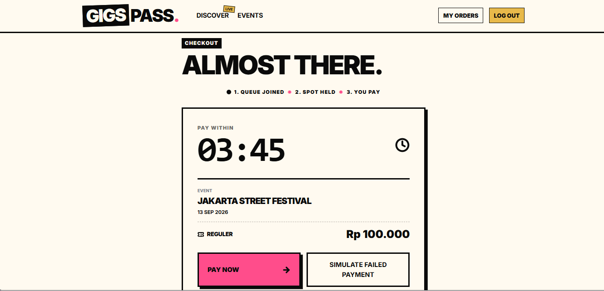
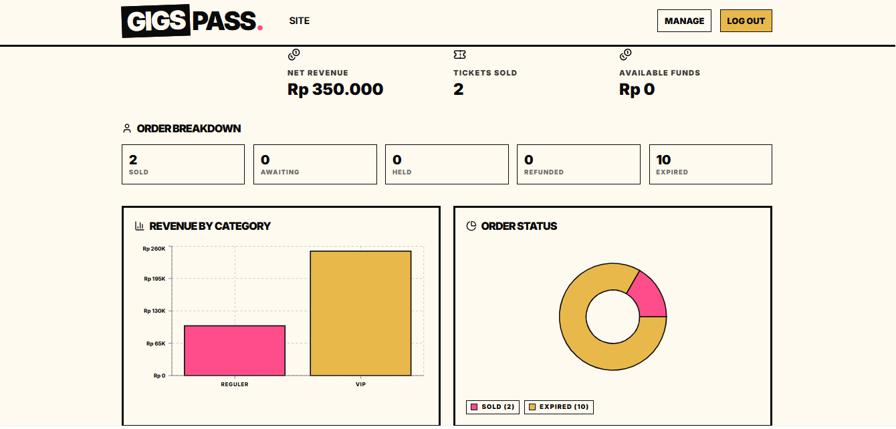

# Gigs Pass

> **Read in English:** [README.md](./README.md). Versi Inggris adalah source of truth; jika ada perbedaan, versi Inggris yang berlaku.

Platform ticketing event yang dirancang untuk menangani trafik flash-sale: buyer masuk ke antrean virtual yang adil, diterima sesuai urutan FIFO, mendapat slot sementara, lalu melakukan pembayaran. Organizer bisa mengelola event dan memantau revenue lewat ledger double-entry. Tidak ada overselling, tidak ada checkout yang error, dan tidak ada bot yang menyerobot antrean.

**Masalah yang saya selesaikan:** ticket drop dengan demand tinggi gagal dengan cara yang bisa diprediksi. Lonjakan checkout membuat server down, race condition menjual stok melebihi kuota, dan bot mengalahkan fans asli. Gigs Pass menangani setiap masalah ini dengan mekanisme yang spesifik: antrean virtual berbasis Redis menyerap lonjakan trafik, operasi stok yang atomik membuat oversell tidak mungkin terjadi, TTL lock mendaur ulang slot yang terbengkalai, dan rate limit per-user membatasi bot.

**Stack:** Node.js + Express, PostgreSQL (Supabase), Redis (Upstash), React (Vite) + Tailwind, Nginx, Docker, AWS EC2, GitHub Actions (CI/CD ke GHCR + EC2).

---

## Peran dan Lingkup

Dibangun sendiri dari awal sampai akhir: API backend dan business logic, flow frontend untuk buyer/organizer/admin, automated testing, pipeline CI/CD, cloud deployment, dan load testing. Cakupan generalist dengan kedalaman di sisi backend.

---

## Demo Langsung

- **App:** http://13-214-56-223.nip.io (instance demo di AWS free tier)
- Registrasi terbuka, jadi buat akun buyer dan coba sendiri flow antreannya: pilih event, join queue, pantau posisimu secara real-time, lalu checkout saat diterima.
- Lebih suka jalankan secara lokal? Lihat [Persiapan Development](#persiapan-development).

---

## Tangkapan Layar

Data demo live di instance AWS free tier.


*Waiting room: posisi antrean live didorong lewat SSE.*


*Checkout: lock admission 300 detik dengan countdown, lalu mock payment.*


*Dashboard organizer: revenue, tiket terjual, status dana, dan chart per tier.*

---

## Keputusan Engineering Kunci

Setiap keputusan di bawah mencantumkan alternatif yang saya pertimbangkan dan alasan saya memilih pendekatan yang ada.

### 1. Antrean FIFO di Redis Sorted Set (skor dari INCR atomik, bukan timestamp)

Alternatif: tabel antrean di database, skor timestamp, antrean in-memory di Node.
Alasan: `INCR queue:seq` menghasilkan urutan monotonik tanpa celah, sehingga ordering skor `ZADD` bersifat strict FIFO bahkan saat join berlangsung secara konkuren. `ZPOPMIN` mengambil dari depan antrean dalam O(log N). Tabel database akan memaksa setiap join menunggu row lock; antrean in-memory akan mati bersama prosesnya dan merusak horizontal scaling. Re-join yang idempoten (cek `ZRANK` sebelum `ZADD`) memastikan retry tidak pernah menduplikat buyer.

### 2. Admission sama dengan lock (TTL 300 detik, diset saat dequeue)

Alternatif: marker "granted" terpisah, diikuti langkah lock belakangan saat checkout.
Alasan: menggabungkan admission dan locking menjadi satu langkah atomik (`SET lock EX 300 NX` + `DECR stock`, dengan rollback `INCR` + `DEL` saat stok negatif) menutup celah re-lock dan menghilangkan satu round trip penuh. Satu grant berarti satu kesempatan: gagal bayar atau biarkan TTL berakhir, dan kamu harus antre ulang. Lock yang kedaluwarsa dibersihkan setiap tick dequeue, dan stoknya kembali ke pool dalam hitungan detik.

### 3. Ledger double-entry dengan entry yang immutable

Alternatif: kolom balance yang bisa diubah di baris akun, atau single transaction log.
Alasan: setiap pergerakan uang menulis baris debit/kredit yang seimbang dan tidak bisa diubah atau dihapus (koreksi dilakukan lewat reversing entry). Balance selalu dihitung dari `SUM`, sehingga uang tidak bisa melenceng dari riwayatnya. Audit pasca-beban pada data produksi mengonfirmasi hal ini: debit Rp500.000 sama persis dengan kredit Rp500.000, nol order berbayar tanpa entry, nol order yang tidak seimbang. Lihat [Audit Ledger Pasca-Beban](#audit-ledger-pasca-beban).

### 4. SSE daripada WebSocket untuk waiting room

Alternatif: WebSocket, polling.
Alasan: waiting room sifatnya satu arah; server yang mendorong update posisi. SSE berjalan di atas HTTP biasa, jadi bisa melewati Nginx dan middleware auth tanpa infrastruktur tambahan, dan sudah mendukung reconnect secara native. Frontend memakai `@microsoft/fetch-event-source` alih-alih `EventSource` native, karena `EventSource` native tidak bisa mengirim header Bearer yang diwajibkan oleh endpoint stream yang terautentikasi.

### 5. Rate limiting yang auth-aware (limit join per-user, limit global per-IP)

Alternatif: satu limiter global per-IP, atau tanpa limiter di join.
Alasan: limit join per-IP akan merugikan pengguna dari kantor atau kampus yang berbagi satu alamat NAT. Limiter join menggunakan kunci `user:id` (setelah autentikasi, tidak terpengaruh NAT) di 30/menit, sementara lapisan global dan Nginx tetap per-IP di 600/menit untuk menangani banjir volumetrik. Login hanya menghitung request yang gagal (`skipSuccessfulRequests`), jadi pengguna normal tidak pernah menghabiskan kuota.

### 6. Cache referensi in-memory daripada Redis tambahan atau query tambahan

Alternatif: cache kategori di Redis, atau terus query Postgres per request.
Alasan: kategori tiket pada dasarnya adalah data referensi yang jarang berubah. `Map` process-local dengan TTL 60 detik di `queueService.js` memangkas query Postgres per join dari 2 menjadi 1, tanpa network hop dan tanpa infrastruktur baru. Penggunaan Redis tetap dibatasi hanya untuk queue, lock, dan stock counter.

### 7. Deploy image GHCR via CI/CD (tanpa build di server)

Alternatif: `git pull` + `docker compose build` di EC2.
Alasan: CI membangun image backend dan frontend sekali, lalu push ke GHCR, dan CD menariknya ke EC2 via SSM. Server tidak menyimpan source code, toolchain, maupun secret build-time. Setiap container produksi bisa dilacak ke commit hash tertentu, dan begitulah cara saya memverifikasi cache deploy (cocokkan digest image, tanpa perlu tebak-tebakan via SSH).

---

## Gambaran Arsitektur

```
┌─────────────┐     ┌─────────────┐     ┌─────────────┐
│   Client    │────▶│   Nginx     │────▶│  Backend    │
│  (React)    │     │  (Proxy)    │     │  (Express)  │
└─────────────┘     └─────────────┘     └──────┬──────┘
                                                │
                     ┌─────────────┐             │
                     │  Upstash    │◀────────────┤
                     │   Redis     │             │
                     └─────────────┘             │
                                                │
                     ┌─────────────┐             │
                     │  Supabase   │◀────────────┘
                     │  PostgreSQL │
                     └─────────────┘
```

| Component    | Technology                 | Purpose                               |
| ------------ | -------------------------- | ------------------------------------- |
| API Gateway  | Nginx                      | Rate limiting, SSL termination, proxy |
| App Server   | Node.js + Express          | Business logic, REST API, SSE         |
| Queue Engine | Upstash Redis (Sorted Set) | Virtual queue, FIFO ordering          |
| Seat Locks   | Upstash Redis (TTL)        | 300s admission lock, no oversell      |
| Database     | Supabase PostgreSQL        | Persistent data, orders, ledger       |
| Frontend     | React + Vite + Tailwind    | Buyer/Organizer/Admin UI              |

---

## Performa Terukur (k6, AWS t3.micro Free Tier)

Saya menguji sistem yang sudah di-deploy secara langsung, bukan sekadar menebak angkanya. Lingkungan: EC2 `t3.micro` (1 vCPU, 1 GB RAM), rate limit dilonggarkan untuk keperluan test, backend Supabase + Upstash, kuota kategori test 5000, pool user k6 80, ramp join 50 ke 300 RPS ditambah ramp SSE konkuren.

> Keterbatasan yang diketahui: isolasi skenario gagal berjalan, sehingga kedua run di bawah mengeksekusi beban join dan SSE secara bersamaan (hingga 800 VU). Anggap angkanya sebagai hasil beban gabungan. Threshold: checks di atas 99%, p95 di bawah 500ms, error di bawah 1%.

### Run 1, skenario join-heavy (5m34s)

| Metric | Value | Threshold | Status |
| ------ | ----- | --------- | ------ |
| HTTP throughput | 26.975 req pada **80,76 req/s** | - | - |
| Join berhasil | **23.567** / 2.332 gagal (sekitar 70,5 join/s) | - | - |
| Checks success | 91,14% | di atas 99% | Gagal |
| HTTP error rate | 8,81% | di bawah 1% | Gagal |
| p95 latency | 4,81s (rata-rata 2,79s) | di bawah 500ms | Gagal |
| Dropped iterations | 13.100 (server terlalu lambat, k6 mengurangi beban) | - | - |

### Run 2, skenario SSE-heavy (5m31,9s)

| Metric | Value | Threshold | Status |
| ------ | ----- | --------- | ------ |
| HTTP throughput | 26.809 req pada **80,78 req/s** | - | - |
| Join berhasil | **23.474** / 2.264 gagal (sekitar 70,7 join/s) | - | - |
| Checks success | 91,34% | di atas 99% | Gagal |
| HTTP error rate | 8,60% | di bawah 1% | Gagal |
| p95 latency | 4,68s (rata-rata 2,83s) | di bawah 500ms | Gagal |
| Dropped iterations | 13.261 | - | - |

### Arti Angka-Angka Ini

Threshold tidak tercapai di kedua run, dan itu sendiri adalah temuannya: ceiling pada instance micro gratis ada di sekitar 80 req/s beban gabungan, dengan database pool (max 20) dan single vCPU sebagai bottleneck. Tapi yang lebih penting dari soal ceiling:

- **Nol kegagalan correctness di beban berapa pun.** Nol oversell (stok habis tepat di kuota), FIFO bertahan di 26k+ request per run, lock yang kedaluwarsa mengembalikan stok ke pool.
- **Sistem terdegradasi dengan baik, tidak crash.** Overload menghasilkan error 500 JSON yang rapi; proses tetap hidup sepanjang run, tanpa hang atau korupsi data.
- **Kesimpulan: ceiling-nya ada di infrastruktur, bukan di desain.** Kode yang sama di instance yang lebih besar akan meningkatkan throughput; tidak ada hasil yang menunjuk ke bottleneck di level logika.
- **Catatan soal rate limit:** kedua run berasal dari satu egress IP dengan limit yang dilonggarkan, jadi angka error/latensi ini tidak boleh dijadikan acuan untuk tuning limiter per-IP; default app sudah divalidasi terpisah lewat synthetic test.

### Audit Ledger Pasca-Beban

Setelah 50k+ request load-test terhadap data produksi, saya menjalankan query integritas read-only di Supabase:

- Balance double-entry global: debit Rp500.000 sama persis dengan kredit Rp500.000 (5 split pembayaran: 5 debit, 10 kredit)
- Order yang dibuat user load-test: nol (load tidak pernah menyentuh checkout, sesuai desain)
- Order tidak seimbang: nol. Order berbayar tanpa ledger entry: nol.
- Stok kategori uji stres tetap utuh: kuota 5000, nol berbayar, nol pending

---

## Cakupan Test

- **271 unit test**, semuanya lolos (service, model, middleware, job, logika queue/lock/ledger dengan DB mock)
- **Suite integrasi** terhadap PostgreSQL dan Redis asli (migration otomatis diterapkan ke database test terpisah)
- **k6 load test** seperti di atas, dengan hasil yang sudah dicommit ke file ini
- **Playwright E2E (10 test, workflow manual)** melawan backend live + PostgreSQL/Redis asli (auth, buyer queue-checkout, organizer, admin override); picu via tab Actions, workflow E2E, Run workflow
- CI menjalankan unit, integrasi, lint frontend, dan production build setiap push; image dikirim ke GHCR hanya jika semuanya hijau

```bash
# Backend unit tests (mocked DB, fast)
cd backend && npm test

# Integration (needs DATABASE_URL_TEST, REDIS_URL)
cd backend && npm run test:integration

# All
cd backend && npm run test:all

# E2E (butuh PostgreSQL + Redis lokal, backend di :5000, lalu frontend preview)
cd frontend && npm run test:e2e
```

---

## Referensi API

Base URL: `/api`. Semua respons menggunakan envelope `{status, message, data}`. Route yang dilindungi memerlukan Bearer JWT.

### Auth (public + self)

| Method | Path | Auth | Notes |
| ------ | ---- | ---- | ----- |
| POST | `/auth/register` | No (10/min/IP) | buyer or organizer |
| POST | `/auth/login` | No (10/min/IP, failures only) | returns JWT |
| GET | `/auth/me` | Yes | session restore |

### Events (public + organizer + admin)

| Method | Path | Auth | Notes |
| ------ | ---- | ---- | ----- |
| GET | `/events` | No | published only, supports `?category=`, returns `min_price` |
| GET | `/events/:id` | No | event detail |
| GET | `/events/mine` | Organizer | own events |
| GET | `/events/:id/categories` | No | tiers for an event |
| GET | `/events/:id/orders` | Organizer | orders and fund status per event |
| POST | `/events` | Organizer | creates `draft` |
| PUT | `/events/:id` | Organizer (owner) | edit own event |
| POST | `/events/:id/image` | Organizer (owner) | poster upload |
| PUT | `/events/:id/publish` | Organizer (owner) | `draft` to `published` |
| PUT | `/events/:id/suspend` | Admin | investigate, pre-event only |
| PUT | `/events/:id/unsuspend` | Admin | back to `published` |
| PUT | `/events/:id/cancel` | Organizer/Admin | triggers refunds, pre-event only |
| POST | `/events/:id/categories` | Organizer | create tier |

### Ticket Categories

| Method | Path | Auth | Notes |
| ------ | ---- | ---- | ----- |
| PUT | `/categories/:id` | Organizer (owner) | edit tier |

### Queue (buyer)

| Method | Path | Auth | Notes |
| ------ | ---- | ---- | ----- |
| POST | `/queue/:categoryId/join` | Yes (30/min/user) | idempotent; 409 carries resumable order |
| GET | `/queue/:categoryId/stream` | Yes (Bearer header, SSE) | `position` events, then `granted`, then close |

### Checkout and Orders (buyer)

| Method | Path | Auth | Notes |
| ------ | ---- | ---- | ----- |
| POST | `/checkout/:categoryId/lock` | Buyer | verifies live reservation (403 without one) |
| GET | `/orders` | Buyer | order history |
| GET | `/orders/:id` | Buyer (owner) | static receipt |
| POST | `/orders` | Buyer | creates `awaiting_payment`; 409 resumes existing |
| POST | `/orders/:id/pay` | Buyer | mock payment `{success}`; success to `pending`, else `expired` |

### Admin and Analytics

| Method | Path | Auth | Notes |
| ------ | ---- | ---- | ----- |
| GET | `/admin/events` | Admin | all events |
| GET | `/admin/orders` | Admin | all orders |
| POST | `/admin/orders/:id/override` | Admin | `held` or `refunded` during holding period |
| GET | `/analytics/event/:id/overview` | Organizer (owner) | revenue, sales per tier, fund status |
| GET | `/analytics/platform/overview` | Admin | cross-event summary |

---

## Persiapan Development

### Prerequisites

- Node.js 20+
- Docker + Docker Compose
- Supabase account (PostgreSQL)
- Upstash account (Redis)

### Environment Variables

```bash
# backend/.env (local dev; production uses root .env, see docs/deployment.md)
DATABASE_URL=postgresql://...
DATABASE_SSL=true
REDIS_URL=redis://...
JWT_SECRET=...
CLOUDINARY_*=
RATE_LIMIT_JOIN_MAX=30
RATE_LIMIT_GLOBAL_MAX=600
```

### Run Locally

```bash
# Backend
cd backend && npm install && npm run dev

# Frontend
cd frontend && npm install && npm run dev

# Or Docker
docker compose up -d
```

### Stress Test (k6)

```bash
# Note: isolate scenarios in separate files for a pure single-scenario run.
# Test procedure (rate-limit bypass header was removed): lift limits via
# .env 99999 + no-limit nginx config, restore afterwards (docs/deployment.md).
k6 run --env TARGET_URL=http://localhost --env CATEGORY_ID=<category_id> tests/load/k6-script.js
```

---

## Deployment

- AWS EC2 free tier (`t3.micro`, 1 vCPU, 1 GB), Nginx sebagai reverse proxy di host (port 80)
- Docker Compose: backend (5000), frontend (3000); Redis/Postgres eksternal
- CI membangun image GHCR saat pipeline hijau; CD deploy ke EC2 via SSM dengan health check
- Security Groups: port 22 (SSH), 80/443 saja; tidak ada port aplikasi yang terbuka
- Runbook lengkap: `docs/deployment.md`

---

## Keamanan

- `.env` tidak pernah dicommit; secret hanya disimpan di environment
- Password: bcrypt (10 rounds); JWT HS256, expiry 7 hari
- Rate limiting: Nginx untuk banjir volumetrik + app yang auth-aware (join per-user, login hanya hitung yang gagal)
- Tidak ada secret di log maupun respons; test bypass hardcoded sudah dihapus

---

## Yang Akan Saya Lakukan Berikutnya

1. **Scale vertikal dulu** (`t3.medium`, pool dari 20 ke 50): cara paling murah untuk mendapat kenaikan ceiling 2–3x, dan sesuai dengan bottleneck yang terukur.
2. **Scale horizontal** (ALB + N node stateless): butuh rate limit store berbasis Redis dan SSE sticky session atau fan-out pub/sub.
3. **Perkuat temuan dari load testing**: file k6 single-scenario yang terisolasi, yang sekaligus berfungsi sebagai harness untuk run before/after mengukur dampak cache kategori in-memory; default rate-limit app (10/10/30/600) sudah divalidasi secara sintetis (`rateLimiter.defaults.test.js` - pola sah lolos dengan nol 429, pola abuse diblokir), tuning nginx/CGNAT masih butuh trafik multi-IP nyata.
4. **Pembayaran asli**: ganti mock dengan gateway sandbox (mis. Xendit) di belakang state machine order yang ada, tanpa perubahan pada arsitektur yang sudah ada.

---

## Lisensi

MIT